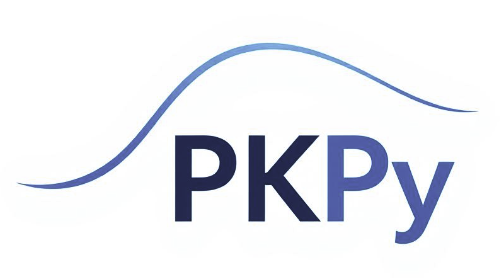

# PKPy: A Python-Based Framework for Automated Population Pharmacokinetic Analysis

[](https://opensource.org/licenses/MIT)
[](https://www.python.org/downloads/)

PKPy is an open-source Python framework that simplifies population pharmacokinetic (PopPK) analysis by emphasizing automation and accessibility. The framework minimizes the need for manual parameter initialization while maintaining analytical rigor, making sophisticated PK analysis more accessible to researchers and practitioners.

## 🚀 Key Features

- **Automated Parameter Initialization**: Minimizes the need for user-specified initial estimates
- **Multiple PK Models**: Supports one-compartment models with and without absorption
- **Integrated Analysis Pipeline**: Combines PopPK modeling with automatic non-compartmental analysis (NCA)
- **Automated Covariate Analysis**: Smart detection of significant parameter-covariate relationships
- **Comprehensive Diagnostics**: Automated generation of goodness-of-fit plots and validation metrics
- **High Performance**: Optimized computations using Numba acceleration

## ⚡ Performance

Comparative analysis on Google Colab shows PKPy's computational advantages:

| Metric | PKPy | Saemix+PKNCA |
|--------|------|--------------|
| Installation Time | 16s | 96s |
| Analysis Time (no initial estimates) | 15s | 101s |
| Analysis Time (with initial estimates) | 13s | 102s |

Key benefits:
- Faster installation with efficient dependency management
- Significantly reduced analysis runtime
- Consistent parameter estimation regardless of initial values
- Robust convergence without requiring manual initialization

## 🛠️ Installation

```bash
pip install git+https://github.com/gumgo91/pkpy.git
```

## 📋 Requirements

- Python ≥ 3.8
- NumPy ≥ 1.20.0
- SciPy ≥ 1.7.0
- Pandas ≥ 1.3.0
- Matplotlib ≥ 3.4.0
- Seaborn ≥ 0.11.0
- Scikit-learn ≥ 0.24.0
- Numba ≥ 0.54.0

## 🚀 Quick Start

### Basic One-Compartment Model

```python
import numpy as np
from pkpy import create_pkpy_model, BasePKWorkflow

# Define model parameters
parameters = {
    "CL": {"value": 5.0, "cv_percent": 15, "lower_bound": 0.1},
    "V": {"value": 50.0, "cv_percent": 15, "lower_bound": 1.0}
}

covariate_models = {
    'CL': {'CRCL': {'type': 'power', 'coefficient': 0.75}},
    'V': {'WT': {'type': 'power', 'coefficient': 0.75}}
}

# Create model and workflow
model = create_pkpy_model("onecomp", parameters)
workflow = BasePKWorkflow(model, n_subjects=20)

# Generate and analyze data
times = np.linspace(0, 24, 10)
workflow.generate_virtual_population(times, covariate_models=covariate_models)
results = workflow.run_analysis(create_plots=True)
workflow.print_summary()
```

### Analyzing Real Data (e.g., Theophylline Dataset)

```python
from pkpy import BasePKWorkflow
from pkpy.utils import convert_data

# Convert data
files = convert_data('Theoph.csv',
                    id_col='Subject',
                    time_col='Time',
                    conc_col='conc')

# Create and run workflow
workflow = BasePKWorkflow.from_files(
    model_type='onecomp_abs',
    conc_file=files['concentrations'],
    time_file=files['times'],
    demo_file=files['demographics'],
    dose=320
)

results = workflow.run_analysis(create_plots=True)
workflow.print_summary()
```

## 📊 Examples and Studies

The repository includes several resources to help you get started and understand PKPy's capabilities:

- `examples/example.ipynb`: Detailed examples of basic usage and features
- `examples/Scenario test.ipynb`: Performance evaluation across various scenarios
- `Comparative study/`: Detailed performance comparison between PKPy and Saemix+PKNCA in Google Colab environment

## 📫 Contact & Support

- Primary Author: Hyunseung Kong (hskong@snu.ac.kr)
- Issue Tracker: https://github.com/gumgo91/PKPy/issues

## 📄 License

This project is licensed under the MIT License - see the [LICENSE](LICENSE) file for details.
