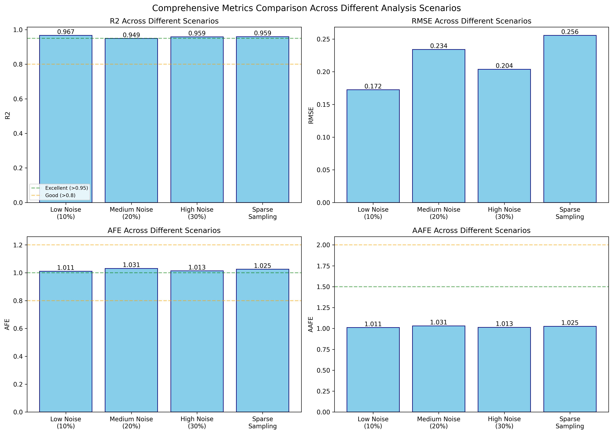

# PKPy: A Python-Based Framework for Automated Population Pharmacokinetic Analysis

[](https://opensource.org/licenses/MIT)
[](https://www.python.org/downloads/)

PKPy is an open-source Python framework that simplifies population pharmacokinetic (PopPK) analysis by emphasizing automation and accessibility. The framework minimizes the need for manual parameter initialization while maintaining analytical rigor, making sophisticated PK analysis more accessible to researchers and practitioners.

## 🚀 Key Features

- **Automated Parameter Initialization**: Minimizes the need for user-specified initial estimates
- **Multiple PK Models**: Supports one-compartment and two-compartment models with and without absorption
- **Integrated Analysis Pipeline**: Combines PopPK modeling with automatic non-compartmental analysis (NCA)
- **Automated Covariate Analysis**: Smart detection of significant parameter-covariate relationships
- **Comprehensive Diagnostics**: Automated generation of goodness-of-fit plots and validation metrics
- **Advanced Validation Metrics**: Includes AFE (Average Fold Error) and AAFE (Absolute Average Fold Error) for enhanced model evaluation
- **Real Data Support**: Built-in support for analyzing standard datasets like Theophylline with automated data preprocessing
- **High Performance**: Optimized computations using Numba acceleration

## 📊 Validation Metrics

PKPy provides comprehensive model evaluation through multiple metrics:

| Metric | Definition | Interpretation |
|--------|------------|----------------|
| **R²** | Coefficient of determination | >0.95: Excellent, >0.8: Good |
| **RMSE** | Root Mean Square Error | Lower is better |
| **AFE** | Average Fold Error = mean(predicted/observed) | 1.0: No bias, >1.0: Overprediction, <1.0: Underprediction |
| **AAFE** | Absolute Average Fold Error = mean(\|predicted/observed\|) | <1.5: Excellent, <2.0: Good |

### Recent Validation Results


## ⚡ Performance

Comparative analysis on Google Colab shows PKPy's computational advantages:

| Metric | PKPy | Saemix+PKNCA |
|--------|------|--------------|
| Installation Time | 16s | 96s |
| Analysis Time (no initial estimates) | 15s | 101s |
| Analysis Time (with initial estimates) | 13s | 102s |

Key benefits:
- Faster installation with efficient dependency management
- Significantly reduced analysis runtime
- Consistent parameter estimation regardless of initial values
- Robust convergence without requiring manual initialization

## 🛠️ Installation

```bash
pip install git+https://github.com/gumgo91/pkpy.git
```

## 📋 Requirements

- Python ≥ 3.8
- NumPy ≥ 1.20.0
- SciPy ≥ 1.7.0
- Pandas ≥ 1.3.0
- Matplotlib ≥ 3.4.0
- Seaborn ≥ 0.11.0
- Scikit-learn ≥ 0.24.0
- Numba ≥ 0.54.0

## 🚀 Quick Start

### Basic One-Compartment Model

```python
import numpy as np
from pkpy import create_pkpy_model, BasePKWorkflow

# Define model parameters
parameters = {
    "CL": {"value": 5.0, "cv_percent": 15, "lower_bound": 0.1},
    "V": {"value": 50.0, "cv_percent": 15, "lower_bound": 1.0}
}

covariate_models = {
    'CL': {'CRCL': {'type': 'power', 'coefficient': 0.75}},
    'V': {'WT': {'type': 'power', 'coefficient': 0.75}}
}

# Create model and workflow
model = create_pkpy_model("onecomp", parameters)
workflow = BasePKWorkflow(model, n_subjects=20)

# Generate and analyze data
times = np.linspace(0, 24, 10)
workflow.generate_virtual_population(times, covariate_models=covariate_models)
results = workflow.run_analysis(create_plots=True)
workflow.print_summary()
```

### Two-Compartment Model

```python
# Define parameters for 2-compartment model
parameters_2comp = {
    "CL": {"value": 5.0, "cv_percent": 25},
    "V1": {"value": 30.0, "cv_percent": 20},
    "Q": {"value": 10.0, "cv_percent": 30},
    "V2": {"value": 50.0, "cv_percent": 25}
}

# Create and analyze
model = create_pkpy_model("twocomp", parameters_2comp)
workflow = BasePKWorkflow(model, n_subjects=50)

# Use longer sampling times for 2-compartment models
times = np.concatenate([
    np.linspace(0, 2, 8),     # Dense early sampling
    np.linspace(3, 8, 5),     # Medium density
    np.linspace(12, 48, 5)    # Sparse later sampling
])

workflow.generate_virtual_population(times, dose=100.0)
results = workflow.run_analysis(create_plots=True)
```

### Analyzing Real Data

```python
from pkpy import BasePKWorkflow
from pkpy.utils import convert_data

# Convert data
files = convert_data('Theoph.csv',
                    id_col='Subject',
                    time_col='Time',
                    conc_col='conc')

# Create and run workflow
workflow = BasePKWorkflow.from_files(
    model_type='onecomp_abs',
    conc_file=files['concentrations'],
    time_file=files['times'],
    demo_file=files['demographics'],
    dose=320
)

results = workflow.run_analysis(create_plots=True)
workflow.print_summary()
```

### Comprehensive Metrics Testing

Test PKPy's validation metrics across different scenarios:

```python
python test_comprehensive_metrics.py
```

This will generate:
- Validation metrics comparison across noise levels
- AFE/AAFE performance evaluation
- Comprehensive metrics summary CSV

## 📊 Examples and Studies

The repository includes several resources to help you get started and understand PKPy's capabilities:

- `examples/example.ipynb`: Detailed examples of basic usage and features
- `examples/Scenario test.ipynb`: Performance evaluation across various scenarios
- `examples/compare_models.ipynb`: Comparison of 1-compartment and 2-compartment models
- `examples/test_2comp_scenarios.py`: Comprehensive testing of all model types
- `analyze_theophylline.py`: Complete Theophylline dataset analysis with AFE/AAFE metrics
- `test_comprehensive_metrics.py`: Validation metrics testing across different scenarios
- `Comparative study/`: Detailed performance comparison between PKPy and Saemix+PKNCA

## 🔬 Recent Improvements

### Version 0.2.0 (Latest)
- **New Validation Metrics**: Added AFE (Average Fold Error) and AAFE (Absolute Average Fold Error) for comprehensive model evaluation
- **Theophylline Data Support**: Built-in loader for analyzing sparse clinical data with automatic preprocessing
- **Enhanced Workflow**: Improved data structure compatibility and error handling
- **Performance Optimization**: Better handling of log-transformed data in metrics calculation

### Validation Performance
Based on comprehensive testing across different scenarios:
- **R² > 0.94** in all test scenarios
- **AFE between 1.01-1.03** (minimal bias <3%)
- **AAFE < 1.05** (excellent prediction accuracy)
- Robust performance across different noise levels and sampling schemes

## 📫 Contact & Support

- Primary Author: Hyunseung Kong (hskong@snu.ac.kr)
- Issue Tracker: https://github.com/gumgo91/PKPy/issues

## 📄 License

This project is licensed under the MIT License - see the [LICENSE](LICENSE) file for details.

## 📚 Citation

If you use PKPy in your research, please cite:

```
Kong H, Kim I, Zhang BT. PKPy: A Python-Based Framework for Automated 
Population Pharmacokinetic Analysis. 2025. Available from: 
https://github.com/gumgo91/PKPy
```
